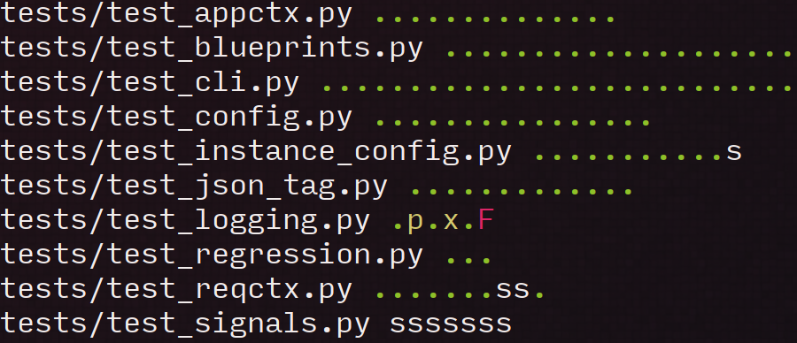

pytest-colordots
================

Colorizes the progress indicators

Usage
-----

Install with:

    pip install -U pytest-colordots

and then run your test suite:

    py.test

and marvel at all the pretty colors

Compatibility
-------------

This plugin uses colorama and should therefore work on Linux, OSX, BSD and
Windows.
